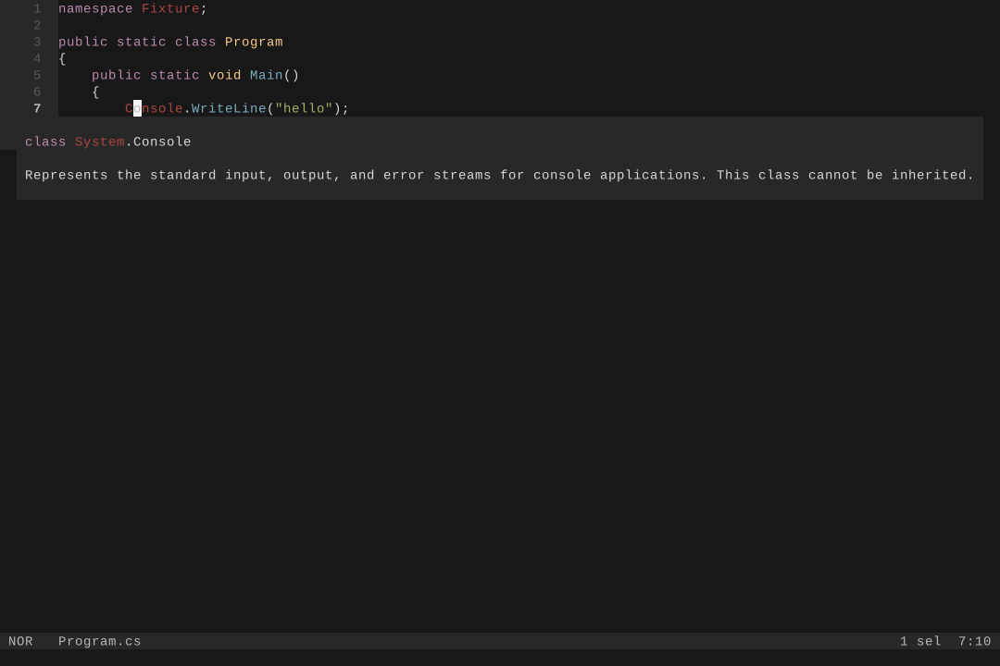

Configure the server command as `csls` with `lsp` as its only argument. Start the
editor from a directory containing a solution or project so Roslyn can load the
workspace.

## Fresh

Add a C# language server entry to `fresh.json`:

```json
{
  "lsp": {
    "csharp": {
      "command": "csls",
      "args": ["lsp"],
      "enabled": true,
      "auto_start": true,
      "root_markers": [".slnx", ".sln", ".csproj", ".git"]
    }
  }
}
```

Fresh only starts language servers in a trusted workspace.

## Helix

Add this to `languages.toml`:

```toml
[language-server.csls]
command = "csls"
args = ["lsp"]

[[language]]
name = "c-sharp"
language-servers = ["csls"]
```

Run `hx --health c-sharp` if Helix cannot find the command.



Click the screenshot to view it at full size. It is captured from the same real
Helix and Hex1b session used by the integration test.

## Neovim

Neovim 0.11 and later can register `csls` directly:

```lua
vim.lsp.config("csls", {
  cmd = { "csls", "lsp" },
  filetypes = { "cs" },
  root_markers = { "*.slnx", "*.sln", "*.csproj", ".git" },
})
vim.lsp.enable("csls")
```

## GNU Emacs

Register `csls` with Eglot before opening a C# buffer:

```elisp
(add-to-list 'eglot-server-programs
             '((csharp-mode csharp-ts-mode) . ("csls" "lsp")))
```

Run `M-x eglot` if the current C# mode does not start Eglot automatically.

## Zed

Select the official C# extension's `csharp-ls` adapter and replace its binary in
Zed settings:

```json
{
  "languages": {
    "CSharp": {
      "language_servers": ["csharp-ls", "!roslyn", "!omnisharp"]
    }
  },
  "lsp": {
    "csharp-ls": {
      "binary": {
        "path": "csls",
        "arguments": ["lsp"]
      }
    }
  }
}
```

## VS Code

Install the `willibrandon.csls` extension and disable the Microsoft C# and C# Dev
Kit extensions so one language client owns each C# document. Desktop and remote
extension hosts run the packaged Native AOT launcher and Roslyn worker. VS Code for
the Web runs csls in a WebAssembly worker and synchronizes the virtual workspace
without requiring a local .NET installation.

The repository runs one feature contract against desktop, remote, Chromium,
Firefox, and WebKit extension hosts. The contract covers hover, completion,
definition, semantic tokens, configurable inlay hints, diagnostics after edits,
formatting, rename, code actions, created files, and server restart.

## Other clients

Any other LSP client that can launch a standard input and output server can run:

```console
csls lsp
```

Use the workspace folder URI during `initialize`. The server discovers `.slnx`,
`.sln`, `.csproj`, and file-based app entry points below that folder. Multi-root
clients can add and remove folders without restarting the server.
