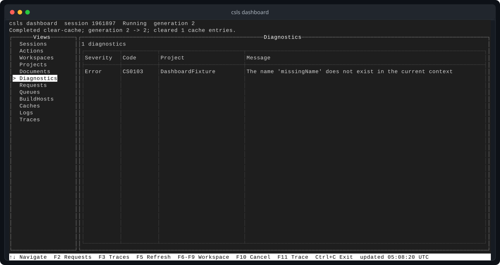

`csls` is a C# language server with a command-line interface and an MCP server.
It uses Roslyn for language intelligence and ships as Native AOT .NET tools for
Windows, Linux, and macOS.

The language server works over standard input and output. A private Unix domain
socket lets the CLI and MCP server use the same live workspace without starting
another compiler process.

Fresh, GNU Emacs with Eglot, Helix, and Neovim are exercised through real editor
sessions in the test suite. The protocol also works with other LSP clients.

The dashboard shows the active workspace, diagnostics, requests, caches, logs,
and traces. Click the screenshot to view the verified Hex1b capture at full size.

[Build csls from source](./getting-started/) or [configure an editor](./editors/).
